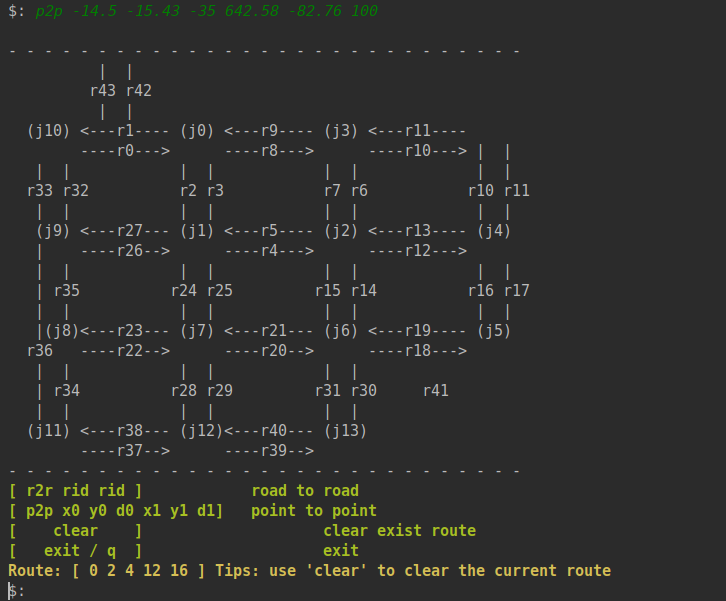
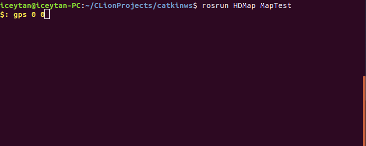
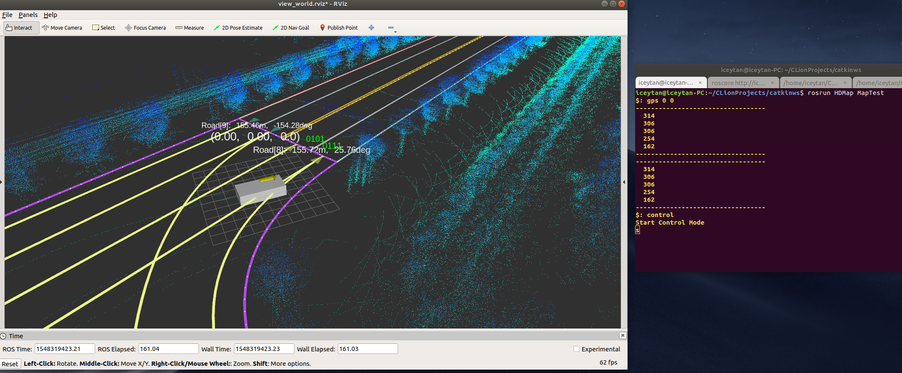

[TOC]

# HDMap Service

hdmap 工程中使用 Agent + Service 组合的方式进行工作，Service维护所有地图，提供必要的地图接口服务；Agent维护规划好的路线的地图，作为业务和接口连接者的存在。此外还可以使用MapView进行可视化，使用Test程序控制车辆移动，进行接口测试。


## Uages

直接调用将hdmap放置到catkin工作区的src目录下，与相应的业务进行配合使用

```
catkin_ws
|-- build
|-- devel
|-- src
    |-- HDMap
    |-- <your project>
```

在业务的CMakeLists.txt中添加`HDMap`，以使用提供的服务接口

```cmake
find_package(catkin REQUIRED COMPONENTS
  ...
  HDMap
)
```


也可以直接使用自带的 `map_cmd.launch`进行请求，也可以自行发送`srv`进行请求。在使用业务之前，务必

```sh
# 在任何窗口使用HDMap前，需先加载环境
$ source devel/setup.sh

# 运行 Agent 和 Server
$ roslaunch HDMap hdmap.launch

# 运行地图控制台
$ roslaunch HDMap map_cmd.launch

# 开启map地图和实时位置展示
$ roslaunch HDMap map_view.launch
```


### 规划一条路到路的路线

在当前版本的HDMap中以路为单位进行规划


*自带控制台*

在 Map command 控制台输入， 满足n > 1 即可

```
r2r road1 road2 ... roadn
```


发送server*

```c++
#include <HDMap/srv_map_cmd.h>
#include <HDMap/msg_route_info.h>
#include <vector>

void OnRouteInfoUpdate(const HDMap::msg_route_info& msg)
{
    Print(msg.route_id);
}

int main()
{
    ros::init(argc, argv, "demo");
    ros::NodeHandle n;
    ros::ServiceClient client = n.serviceClient<HDMap::srv_map_cmd>("map_command");
    ros::Subscriber　subscriber = n.subscribe("/map_pub_route_info",1,
                                             　OnRouteInfoUpdate);
    std::vector<int> v;
    
    HDMap::srv_map_cmd srv;
    srv.request.cmd = "r2r";
    srv.request.argv.push_back( road1 );
    srv.request.argv.push_back( road2 );
    ...
    if(client.call(srv))
    {
        v = srv.response.route;
    }
}
```


### 规划一条点到点的路线

> !!! 目前只支持两个点之间的规划 !!!


*自带控制台*

在 Map command 控制台输入起始点和终止点的坐标，起始点需要包含方向，终止点现在暂时没有考虑方向，所以只要求x2与y2 准确即可

```
p2p x1 y1 heading1 x2 y2 -
```





*发送server*

```c++
#include <HDMap/srv_map_cmd.h>
#include <vector>

void OnRouteInfoUpdate(const HDMap::msg_route_info& msg)
{
    Print(msg.route_id);
}

int main()
{
    ros::init(argc, argv, "demo");
    ros::NodeHandle n;
    ros::ServiceClient client = n.serviceClient<HDMap::srv_map_cmd>("map_command");
    ros::Subscriber　subscriber = n.subscribe("/map_pub_route_info",1,
                                             　OnRouteInfoUpdate);
    std::vector<int> v;
    
    HDMap::srv_map_cmd srv;
    srv.request.cmd = "p2p";
    srv.request.argv.push_back( -14.15 );
    srv.request.argv.push_back( -15.43 );
    srv.request.argv.push_back(  -35  );
    srv.request.argv.push_back(  642.58 ); 
    srv.request.argv.push_back(  -82.76 );
    srv.request.argv.push_back(  100 );
    if(client.call(srv))
    {
        v = srv.response.route;
    }
}
```


无论是何种方式进行服务的请求，服务只返回一个请求成功与否的布尔值，如果需要知道道路的信息，需要额外进行道路信息的订阅，主题为`map_pub_route_info` 的消息包含经过的路的坐标和路的编号。


### 地图仿真测试

加载环境后，运行

```sh
$ rosrun HDMap MapTest
```





此外还请开启地图服务和map地图和实时位置展示

```shell
$: roslaunch HDMap hdmap.launch
$: roslaunch HDMap map_view.launch
```

此时RVIZ会打开，并自动加载资源，这时候使用MapTest进行车辆仿真控制。





*绝对控制位置*

```sh
$: gps 0 0
```

方向值为缺省值，默认为0，当然可以直接指定，使用的单位是**角度**

```
$: gps 0 0 25
```


*WSAD控制*

可以使用 WSAD键控制仿真的移动，需要先输入命令

```sh
$: control
```

接着进入控制模式，此时使用WSAD分别进行上、下、原地左旋、原地右旋的操作，使用空格键加速，使用r键减速，注意不要超出道路，否则会有不好的后果。在仿真的过程中会有边缘点数量的打印，暂时使用这一打印信息判断服务器是否正常。


### 增加地图

HDMap 提供绘制高精度地图的接口，常熟智能车中心的“九宫格”地图代码在 `MapGenerator.cpp`中。

构建高精度地图中的一条路需要确定

* Road 的起始姿态
* Road Section 的结束姿势，用于控制 Road Section 弯曲程度的贝塞尔曲线的两端控制长度
* Lane 的 id 号，起始宽度和结束宽度；此外，还可以输入当前lane连接的lane的id以及后续连接的lane的id，如在当前的lane连接到上一个road section 的2、3号lane，那么此时输入 `{2,3}`


*example*

下面为添加一段单行路的例子

```c++
// 添加一条路到 map 中，并得到路的引用对象 r2，r2的起始点为(-5.58, -27.31),方向为 -56.6636
auto r2 = map.AddRoad({-5.58, -27.31, -56.6636});

// 在r2中添加一段 road section，终止点为 (9.67, -50.47)，方向为 -56.6636
auto r2_s0 = r2->AddSection({9.67, -50.47, -56.6636});
// r2_s0中只有一条lane，id设置为1，起始的宽度为2.8米，终止的宽度为2.8米，此lane不接续任何lane，
// 设置为`{}`, 此lane接续下一个section中id为1的lane，设置为 `{1}`
r2_s0->AddLane( 1, 2.8, 2.8, {}, {1});

// 在r2中添加一段 road section，终止点为 (25.95, -72.92)，方向为 -56.7125，而这一段road 
// section为贝塞尔曲线，两端的控制长度分别为 15.0,15.0
auto r2_s1 = r2->AddSection({25.95, -72.92, -56.7125}, 15.0, 15.0);
// r2_s1中只有一条lane，id设置为1，起始的宽度为2.8米，终止的宽度为4.6米，此lane接续上一段
// section中id=1的lane，设置为`{1}`, 接续下一个section中id为1的lane，设置为 `{1}`
r2_s1->AddLane( 1, 2.8, 4.6, {1}, {1});

// 在r2中添加一段 road section，终止点为 (49.15, -108.16)，方向为 -56.7125
auto r2_s2 = r2->AddSection({49.15, -108.16, -56.7125});
// r2_s2中只有一条lane，id设置为1，起始的宽度为4.6米，终止的宽度为4.6米，此lane接续上一段
// section中的id=1的lane，设置为`{1}`, 接续下一个section中id为1和2的lane，设置为 `{1,2}`
r2_s2->AddLane( 1, 4.6, 4.6, {1}, {1, 2});

// 在r2中添加一段 road section，终止点为 (63.2, -127.27)，方向为 -56.7125，而这一段road
// section 为贝塞尔曲线，两端的控制长度分别为 10.0,10.0
auto r2_s3 = r2->AddSection({63.2, -127.27, -56.7125}, 10.0, 10.0);
// r2_s3中有两条lane，id分别设置为1和2；对于1号lane，起始的宽度为4.6米，终止的宽度为2.8米，
// 此lane接续上一段section中id=1的lane，设置为`{1}`, 接续下一个section中id为1的lane，设
// 置为 `{1}`；对于2号lane，起始的宽度为4.6米，终止的宽度为2.8米，此lane接续上一段section
// 中id=1的lane，设置为`{1}`, 接续下一个section中id为1的lane，设置为 `{1}`
r2_s3->AddLane(1, 4.6, 2.8, {1}, {1});
r2_s3->AddLane(2, 4.6, 5.8, {1}, {2});

// 在r2中添加一段 road section，终止点为 (76.79, -148.087)，方向为 -56.7125
auto r2_s4 = r2->AddSection({76.79, -148.08, -56.7125});
// r2_s4中有两条lane，id分别设置为1和2；对于1号lane，起始的宽度为2.8米，终止的宽度为2.8米，
// 此lane接续上一段section中id=1的lane，设置为`{1}`, 无接续，设置为`{}`;对于2号lane，起
// 始的宽度为5.8米，终止的宽度为5.8米，此lane接续上一段section中id=1的lane，设置为`{1}`, 
// 无接续，设置为`{}`.
r2_s4->AddLane(1, 2.8, 2.8, {1}, {});
r2_s4->AddLane(2, 5.8, 5.8, {2}, {});
```


下面为添加一个路口区域的例子

```c++
// 添加一个路口区域到 map 中，并得到路的引用对象 junc1
auto junc1 = map.AddJunction();
// 向 junc1 中添加一条road link，从2号路连接到4号路，方向标记为 "left"，并且
// 从2号路的最后一个road section的1号lane连接到4号路的第一个road section的
// 1号lane，一条roadlink为一条贝塞尔曲线，指定两端的控制长度为15.0和15.0
map.AddRoadLink(junc1, 2, 4, "left", {make_tuple(1, 1, 15.0, 15.0)});
// 向 junc1 中添加一条road link，从2号路连接到24号路，方向标记为 "forward",
// 方向的标记还可以标记为 "left"、"right"、"forward"
// 并且从2号路的最后一个road section的2号lane连接到24号路的第一个road section
// 的1号lane，一条roadlink为一条贝塞尔曲线，指定两端的控制长度为10.0和10.0
map.AddRoadLink(junc1, 2, 24, "forward", {make_tuple(2, 1, 10.0, 10.0)});
```

